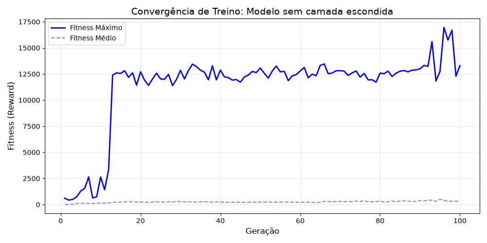
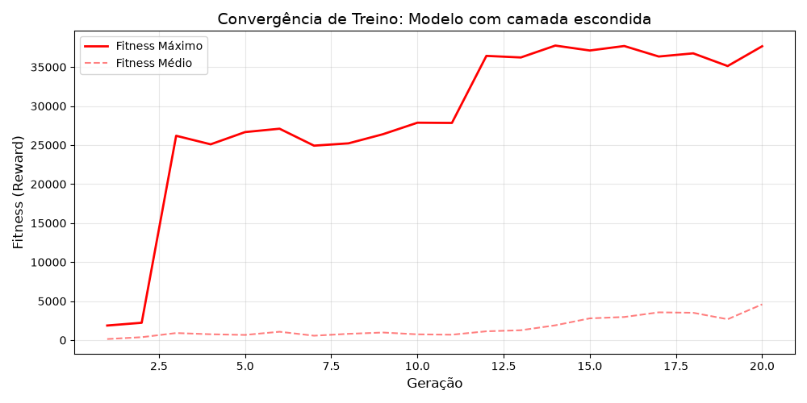
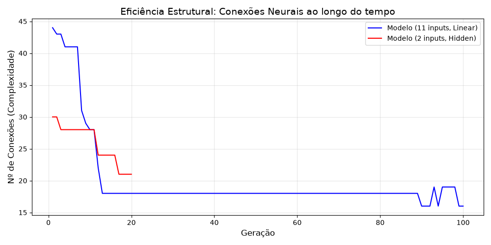

#  SI2 - Space Invaders: Agente Autónomo (NEAT)

- ### Grupo 2 (Francisco Carvalho - 114492; João Viegas - 11)

Este repositório contém a implementação de um agente inteligente para o jogo Space Invaders, desenvolvido no âmbito da unidade curricular de Sistemas Inteligentes II. O projeto explora o algoritmo **NEAT** (NeuroEvolution of Augmenting Topologies) para criar um agente capaz de performance sobre-humana através de **Feature Engineering** avançada e **Reward Shaping** incremental.

## 1. Instruções de Execução

### Pré-requisitos
- Python 3.10+
- Instalação de dependências: `pip install -r requirements.txt`

### Como correr o agente
1. **Iniciar o Servidor:**
   ```bash
   python3 -m server.server
   ```
2. **Carregar o Agente:**
   ```bash
   python3 -m agents.ml_agent
   ```
*Nota: Por defeito, o agente utiliza o ficheiro `winner.pkl` (Versão 4 Final).*

---

## 2. Estudo de Arquiteturas: Modelo A vs. Modelo B

Durante o desenvolvimento, comparámos duas filosofias de design distintas para o "cérebro" da IA:

| Característica | Modelo A (Nossa Solução Final) | Modelo B (Abordagem por Complexidade) |
| :--- | :--- | :--- |
| **Topologia** | 11 inputs, 0 camadas escondidas (Linear) | 2 inputs, 1 camada escondida (**6 neurónios**) |
| **Inputs** | Vetor rico (Cooldown, Posição absoluta, Alvos) | Minimalista (Distância relativa $dx$ e altura $y$) |
| **Filosofia** | **Feature Engineering**: Informação "mastigada" | **Deep Learning**: Rede descobre as regras |
| **Performance** | **50.000+ pontos** (Imbatível) | ~20.000 pontos (Instável em RNG extremo) |
| **Vantagem** | Alta fiabilidade e sem latência de decisão | Convergência rápida em cenários simples |

---

## 3. Funções de Recompensa e Evolução (A "História")

O Agente A foi treinado de forma incremental através de 5 fases de **Fine-Tuning**, partindo do "campeão" da fase anterior para herdar conhecimentos táticos.

### Fase 0: Modelo Base (`winner_goated_behaviour.pkl`)
Treino focado em sobrevivência reativa:
$$Fitness = (Score \times 10) + (Steps \times 0.5) - (VidasPerdidas \times 500)$$
*   **Comportamento:** Aprendeu a interceptar aliens em *dive*.
*   **Problema:** Muito passivo (*Camping*), encostando-se aos cantos e sendo vulnerável a ataques opostos.

### Fase 1: Paradigma "Speedrun"
Substituição da recompensa de tempo por uma penalização para aumentar a agressividade:
$$Fitness = (Score \times 10) - (Steps \times k) - (VidasPerdidas \times 500)$$
*   Testaram-se $k=0.75$ e $k=1.0$. O modelo tornou-se um atirador muito mais rápido.

### Fase 2: Modo Caçador e Robustez
Introdução de bónus por alinhamento com aliens estáticos quando o ecrã estava livre de *dives*, e aumento do limite de simulação para **6000 steps**.
*   **Resultado:** O agente passou a patrulhar ativamente a base para limpar a wave antes dos ataques começarem.

### Fase 3: Reforço de Prioridades e o Problema do *Jitter*
Aumento das recompensas de alinhamento ($0.4$ para *divers* e $1.0$ para estáticos).
*   **Problema:** O modelo de $k=0.75$ desenvolveu um tremor (*jitter*). Como a nave se move de 1 em 1 e os aliens em frações (floats), a IA tentava alinhar-se com casas decimais impossíveis de atingir.

### Fase 4: Discretização de Alvos (Modelo Final)
Implementação da função `round()` na posição X dos aliens para o cálculo de distância.
*   **Resultado Final:** Eliminação total do tremor. O agente considera o alinhamento perfeito assim que entra no mesmo bloco que o alien. **Performance recorde de 50k pontos sem perdas de vida.**

---

## 4. Análise Técnica do Modelo B (Hidden Layer)

O Modelo B utilizou a topologia de uma camada escondida com 6 neurónios e apenas 2 inputs ($dx, y$). A sua função de fitness foi inspirada na Fase 4 do Modelo A:
*   Utilização de **Mapa de Calor (Anti-Camping)**: Penalização de 90% no fitness se a permanência num bloco X excedesse 45%.
*   Priorização de **Zona de Evasão**: Abaixo de $Y=4.0$, prioriza fuga; acima, prioriza tiro.

**Conclusão Comparativa:**
Embora o Modelo B tenha aprendido a lógica de alinhamento e disparo muito rapidamente, a falta de um **Sensor de Cooldown** (presente no Modelo A) tornou-o menos eficiente. O Modelo A, ao ser linear e ter inputs precisos, provou ser superior na gestão da cadência de tiro e na estabilidade de movimento a longo prazo.

---

## 5. Avaliação de Performance

### Resultados
- **Score Máximo:** > 50.000 pontos.
- **Consistência:** 100% de sobrevivência em cenários de 3 minutos de RNG intenso.
- **Eficiência:** Redução de 44 para 16 conexões neurais ao longo do treino (poda por eficiência).

### Gráficos de Treino





1.  **Convergência de Fitness:** Evolução do Fitness Médio vs Máximo.
2.  **Complexidade Estrutural:** Comparativo do número de conexões (Modelos A vs B).
